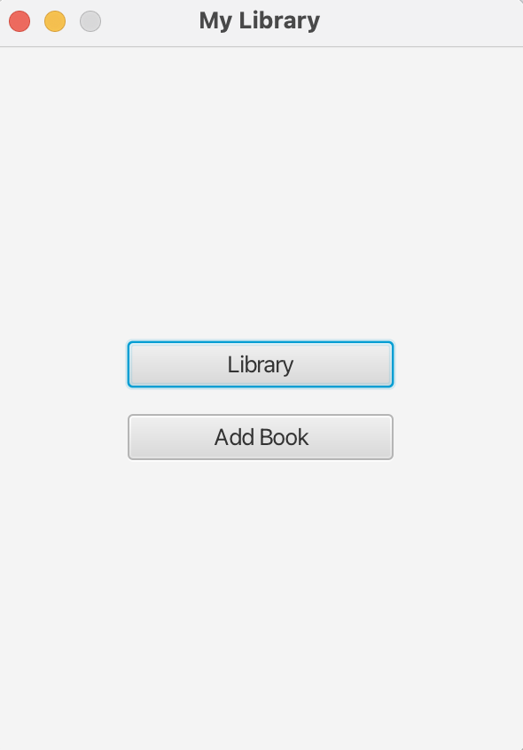

# 📚 Book Tracker (JavaFX)

This is a **JavaFX-based book tracking application.**  
You can build your own library, add books, delete books, and track your reading progress.  

## ✨ Features
- Store books in a **CSV file**  
- Add, delete, and list books  
- Display and update **reading progress**  
- Simple and user-friendly interface  

---

## 🖥️ Screenshots
### Home Screen


### Library Page


### Book Details


### Add Book Page


> **Note:** Place screenshots in the `docs/screenshots/` folder.  

---

## ⚙️ Installation and Running

### 1️⃣ Requirements
- **Java 17+** (for JavaFX support)
- Maven or Gradle (optional)
- JavaFX libraries  

### 2️⃣ Run the Project
1. Clone the repository:
   ```bash
   git clone https://github.com/username/book-tracker.git
   cd book-tracker
